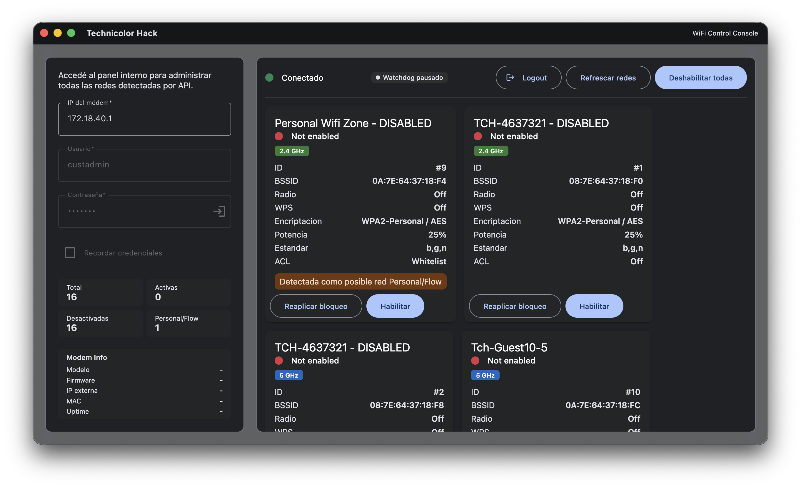

# TechnicolorHack

TechnicolorHack is an Electron desktop application built with Angular 21.2.1 for managing hidden WiFi networks on Technicolor CGA 4233 cable modems, commonly deployed by Personal and Fibertel in Argentina. It exposes controls that are either difficult or impossible to reach from the stock modem interface, while keeping the modem communication inside the Electron main process rather than the Angular renderer.



## What It Does

TechnicolorHack is designed for one very specific operational problem: ISP-managed Technicolor CGA 4233 units may expose or silently re-enable hidden WiFi networks that are not conveniently manageable from the default web UI. This application provides a focused control surface for inspecting, disabling, and monitoring those networks.

Current capabilities include:

- Secure modem login through the modem's two-step authentication flow, including PBKDF2 password hashing.
- Automatic gateway detection, with manual modem IP support when needed.
- Loading and displaying up to 51 WiFi entries exposed by the modem API.
- Enabling or disabling individual WiFi networks.
- Disabling every active WiFi network in one action.
- Refreshing the WiFi inventory without re-authenticating.
- Persisting credentials locally through Electron safe storage.
- Polling the modem in the background with a watchdog that can automatically disable WiFi networks re-enabled by the ISP.
- Running as a tray application on macOS, including close-to-tray behaviour.
- Displaying modem system information such as model, firmware, MAC address, external IP, and uptime.
- Showing richer per-network telemetry, including band, radio status, WPS, encryption mode, transmit power, and ACL status.
- Following the operating system theme in real time, with native desktop styling.

## Interface Highlights

The current desktop UI includes:

- A connection form for modem IP, username, and password.
- Remember-credentials support.
- A connection status indicator.
- A system information panel after login.
- Individual WiFi cards with loading states and toggle feedback.
- A global progress bar for longer operations.
- A confirmation flow before disabling all active WiFi networks.
- Snackbar notifications for errors, actions, and watchdog events.
- A watchdog status badge and tray integration.

Each WiFi card can surface:

- SSID and WiFi ID.
- BSSID.
- Radio state.
- WPS state.
- 2.4 GHz or 5 GHz band detection.
- Operating standard.
- Encryption mode and method.
- Transmit power percentage.
- ACL mode.
- A badge for networks that look like ISP-managed Personal or Flow entries.

## Architecture

The renderer never talks to the modem directly.

Communication flow:

```text
Angular component -> THackService -> window.thack -> Electron IPC -> Electron API handlers -> modem HTTPS API
```

This separation keeps session cookies, CSRF tokens, and modem-facing HTTPS requests inside the Electron main process.

High-level structure:

- `src/app/`: Angular standalone UI built with Angular Material.
- `electron/`: Electron main process, preload bridge, tray logic, watchdog, and modem API integration.
- `electron/api/request.ts`: HTTPS client for the modem API.
- `electron/api/handlers.ts`: IPC handlers that coordinate authentication, WiFi operations, and system queries.

## Stack

- Angular 21.2.1
- Angular Material 21.2.1
- Electron 40
- RxJS 7
- TypeScript 5.9
- Axios
- SJCL

## Development

Install dependencies:

```bash
npm i
```

Run the full desktop development workflow:

```bash
npm run dev
```

That command starts:

- TypeScript watch compilation for the Electron process.
- The Angular development server on port 4200.
- Electron, after waiting for the Angular server to become available.

Other useful commands:

```bash
# Angular dev server only
npm start

# Angular build
npm run build

# Production Angular build to dist/
npm run angular:build

# Electron build
npm run electron:build

# Package the desktop app into release/
npm run electron:package

# Headless daemon for Raspberry Pi
npm run daemon:wifi-zone -- --help
```

## Raspberry Pi Daemon

This repository also includes a small Node.js daemon for a Raspberry Pi that performs the modem sequence required to disable ISP-managed WiFi reliably:

1. Login to the modem.
2. Find the target WiFi network.
3. Send `enable`.
4. Wait a few seconds.
5. Send `disable`.
6. Logout.

Files:

- `daemon/technicolor-wifi-zone-daemon.js`: long-running service with an hourly scheduler.
- `daemon/package.json`: minimal runtime dependencies for the Raspberry Pi daemon.
- `daemon/technicolor-wifi-zone.service`: `systemd` unit template.
- `daemon/technicolor-wifi-zone.env.example`: environment variables example.
- `daemon/upload-to-raspi.sh`: copies the daemon folder to the Raspberry Pi over SSH.
- `daemon/install-on-raspi.sh`: installs dependencies and enables the `systemd` service on the Raspberry Pi.

The daemon does not hardcode credentials. Copy the example env file on the Raspberry Pi, fill in the modem values there, and point the `systemd` unit to that file.

Local dry-run examples:

```bash
# Show usage
npm run daemon:wifi-zone -- --help

# Run one cycle with your shell environment
MODEM_IP=172.18.40.1 \
MODEM_USERNAME=custadmin \
MODEM_PASSWORD='your-password' \
TARGET_SSID_PREFIXES='personal,flow,zona wifi' \
INITIAL_DELAY_MINUTES=15 \
npm run daemon:wifi-zone -- --once
```

Suggested Raspberry Pi deployment layout:

```bash
./daemon/upload-to-raspi.sh

ssh pi3admin@pi3server.local
cd ~/technicolor-wifi-zone-deploy/daemon
cp technicolor-wifi-zone.env.example technicolor-wifi-zone.env
nano technicolor-wifi-zone.env
./install-on-raspi.sh
```

Adjust `EnvironmentFile`, `WorkingDirectory`, and `ExecStart` in the service file if your Raspberry Pi uses a different install path or Node binary.

## Packaging

Packaged artifacts are generated under `release/`. The Electron entry point is compiled into `dist/`, and the packaged desktop application is produced with `electron-builder`.

## Operational Notes

- The application is tailored to Technicolor CGA 4233 modems.
- The UI is currently in Spanish.
- The watchdog polls on a fixed interval in the current implementation.
- HTTPS certificate validation is intentionally disabled for the modem connection because these devices typically ship with self-signed certificates.
- WiFi networks are sorted with enabled entries first, then alphabetically.
- Only one modem session is managed at a time.

## Testing

There is currently no dedicated linting or automated test suite configured in the project.

## License

No license file is currently included in this repository.
